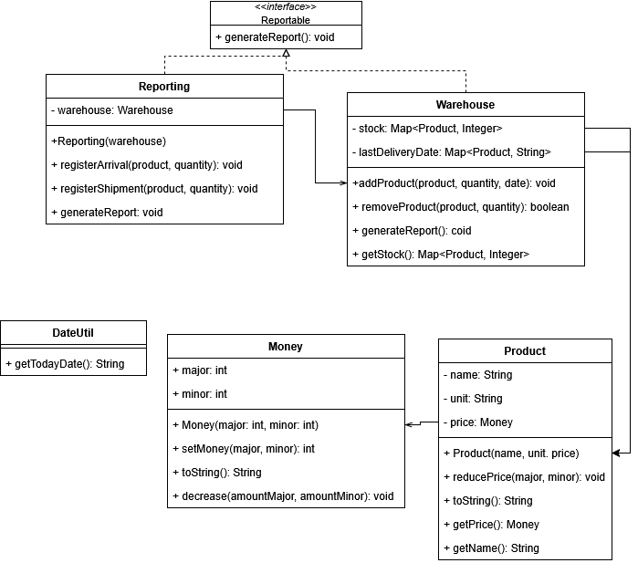

# Система обліку складу 

## Опис

Цей проєкт реалізує систему обліку товарів на складі мовою Java з дотриманням основних принципів програмування. Програма дозволяє:
- працювати з грошима у вигляді класу `Money`,
- створювати продукти (`Product`) з ціною,
- зберігати товари на складі (`Warehouse`),
- вести звітність про надходження та відвантаження (`Reporting`),
- будувати інвентаризаційний звіт.

---

## UML-діаграма

---

## Реалізовані принципи програмування

### 1. **DRY (Don't Repeat Yourself)** — Не повторюй себе
- Грошові операції (відображення, зменшення суми) винесені у клас `Money`, що дозволяє уникати дублювання коду.
- **Приклад:** [`Money.java`](src/money/Money.java)

### 2. **KISS (Keep It Simple, Stupid)** — Простіше краще
- Кожен клас відповідає лише за свою частину логіки (гроші, товар, склад, звітність).
- **Приклад:** [`Warehouse.java`](src/warehouse/Warehouse.java)

### 3. **SRP (Single Responsibility Principle)** — Принцип єдиної відповідальності (SOLID)
- `Money` відповідає за валюту;
- `Product` — за опис товару;
- `Warehouse` — за облік кількості;
- `Reporting` — за формування звітів.
- **Приклад:** [`Product.java`](src/product/Product.java)

### 4. **OCP (Open/Closed Principle)** — Відкритість до розширення, закритість до змін (SOLID)
- Класи розроблені так, щоб їх можна було розширювати без зміни внутрішньої логіки.
- **Наприклад:** можна додати дочірній клас `ElectronicsProduct`, не змінюючи `Warehouse`.

### 5. **LSP (Liskov Substitution Principle)** — Принцип підстановки Лісков (SOLID)
- Якщо додати підкласи до `Product`, вони зможуть без проблем заміщувати базовий клас у `Warehouse` або `Reporting`.

### 6. **DIP (Dependency Inversion Principle)** — Принцип інверсії залежностей (SOLID)
- Клас `Reporting` працює із переданим об’єктом `Warehouse`, не створюючи його самостійно.
- **Приклад:** [`Reporting.java`](src/reporting/Reporting.java)

### 7. **YAGNI (You Aren’t Gonna Need It)** — Тобі це не знадобиться
- Реалізовано лише необхідний функціонал: немає зайвих фіч, які не використовуються у програмі.

### 8. **Composition Over Inheritance** — Композиція замість наслідування
- `Warehouse` володіє `Product`, а не наслідує його.
- **Приклад:** [`Warehouse.java`](src/warehouse/Warehouse.java)

### 10. **Fail Fast** — Швидке виявлення помилок
- Спроба зняти товар зі складу перевіряє наявність кількості й одразу повідомляє, якщо товару недостатньо.
- **Приклад:** [`Warehouse.java`](src/warehouse/Warehouse.java)

